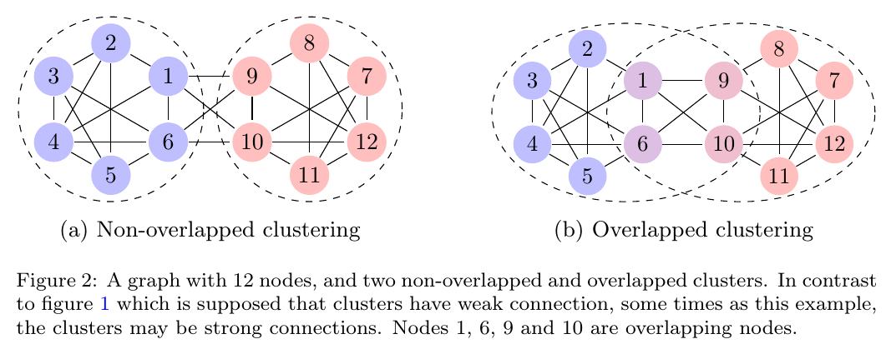

Overlapping-Cluster-GCN
==========
 [](https://github.com/mamintoosi/Overlapping-Cluster-GCN/archive/master.zip)
 [](https://github.com/mamintoosi/Overlapping-Cluster-GCN/network)
[](https://github.com/mamintoosi/Overlapping-Cluster-GCN/issues)
[](https://github.com/mamintoosi/Overlapping-Cluster-GCN/blob/main/LICENSE)
 
 
A PyTorch implementation of "Overlapping Clusters in Cluster Graph Convolutional Networks"
<p align="center">
  
</p>

This repository provides a PyTorch implementation of Overlapping-Cluster-GCN as described in the following paper:

> <a href="https://jac.ut.ac.ir/article_85195.html"> Overlapping Clusters in Cluster Graph Convolutional Networks, </a>
> Mahmood Amintoosi,
> JAC, 53(2), pp. 33-45, 2021


### Abstract

<p align="justify">
A popular research topic in Graph Convolutional Networks (GCNs) is to speedup
the training time of the network. The main bottleneck in training GCN is the
exponentially growing of computations.  In Cluster-GCN based on this fact that each
node and its neighbors are usually grouped in the same cluster, considers the
clustering structure of the graph, and expand each node’s neighborhood within
each cluster when training GCN. The main assumption of Cluster-GCN is the
weak relation between clusters; which is not correct at all graphs. Here we extend their approach by overlapped clustering, instead of crisp clustering which
is used in Cluster-GCN. This is achieved by allowing the marginal nodes to
contribute to training in more than one cluster. The evaluation of the proposed
method is investigated through the experiments on several benchmark datasets.
The experimental results show that the proposed method is more efficient than
Cluster-GCN, in average.
</p>


### Requirements
The codebase is implemented in Python 3.7.11 on Google colab. package versions used for development are just below.
```
torch-scatter 		2.0.8
torch-sparse		0.6.11
torch-geometric		1.7.2
texttable		1.6.4
karateclub		1.2.1
```

### Run on Google Colab
https://colab.research.google.com/github/mamintoosi/Overlapping-Cluster-GCN/blob/master/OverlappingClusterGCN.ipynb

### Datasets
<p align="justify">
We used some of the citation network datasets, which are accessible from <a href=https://pytorch-geometric.readthedocs.io/en/latest/modules/datasets.html>
PyTorch-geometric </a>
</p>

#### Model options
```
  --clustering-method   STR     Clustering method.             Default is `DANMF`.
  --cluster-number      INT     Number of clusters.            Default is 2x Number of dataset labels. 
  --seed                INT     Random seed.                   Default is 42.
  --epochs              INT     Number of training epochs.     Default is 10.
  --test-ratio          FLOAT   Training set ratio.            Default is 0.3.
  --learning-rate       FLOAT   Adam learning rate.            Default is 0.01.
  --dropout             FLOAT   Dropout rate value.            Default is 0.5.
  --layers              LST     Layer sizes.                   Default is [16, 16, 16]. 
  --membership-closeness FLOAT  WMC parameter					Default is 0.1
  --dataset-name		STR		Dataset Name					Default is Cora
```
-------------------------------------------------------

This code is heavily borrowed from <a href="https://github.com/benedekrozemberczki/ClusterGCN">ClusterGCN</a>


[]()
